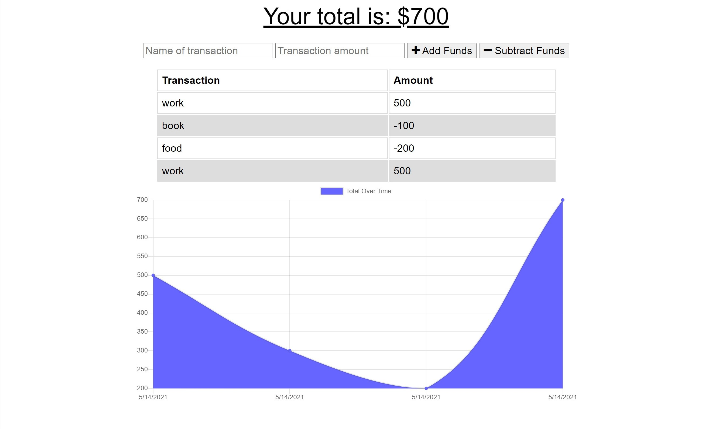

# Budget-Trackers

I want to create a app that allow a user to track their budget online or offline.

- user should be able to enter deposits and expenses offline
- the information should be shown on the page
- the information should be add to the transaction history when the user is reconnected to the internet

project website: https://pure-fortress-36852.herokuapp.com/

